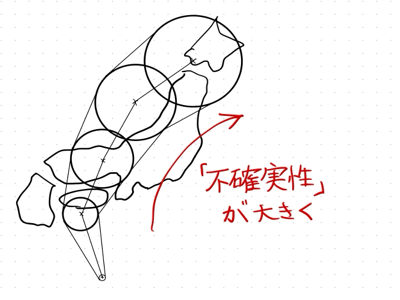

## 1-1 身の回りの予測と不確実性
### 予測とは？
天気予報など私たちの身の回りでは，未知の現象に対する「予測」で溢れています．オンラインショッピングの履歴から興味のある商品を提案することも「予測」の一種と言えるかもしれません．他にも，地図アプリを使うと目的地までの経路がリストアップされます．その中で，ある経路を選ぶと移動時間が見積もられますがこれも「予測」にあたります．

### 不確かな予測
私たちが日々目にしている予測には「不確かさ」がつきまといます．この「不確かさ」は不確実性とも言い換えられます．天気予報は予測の不確実性を理解する良い例です．ご存じの通り，天気予報は当たる時も外れる時もあります．朝のニュースでは雨が降らない予報だったので，傘を持たずに外出して雨に降られたこともあるのではないでしょうか？このような経験から，私たちは将来の天気を予報する際には不確実性が伴うことを身をもって知っています．他の例では，地図アプリに表示される移動時間もあくまで全ての移動行程がスムーズに進んだ場合の見積もりであり，不確実性があります．途中で電車に乗り遅れたり，バスが遅延したりすると当初の見積もりより大幅に時間がかかることがあります．

### 不確実性と意思決定
予測の不確実性の原因はさまざまです．知りたい現象が複雑すぎたり，情報が足りなかったりとさまざまな理由で予測に不確かさが生まれます．このため，予報を出す側も含まれている不確実性を降水確率や台風の予報円などを使って私たちに知らせています．台風の予報円が大きいほど進路予測のばらつきが大きく，不確実性が高いことを表しています．私たちは，予報円が大きい時は最悪の場合を想定して，旅行やイベントの予定変更などを考えることもあります．このように私たちは「予測」とその「不確実性」の情報を日々目にしており，暗黙のうちに「不確実性」も考慮して意思決定を行なっています．

