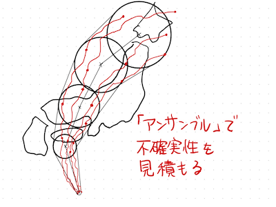

## 1-2 シミュレーションによる予測と限界
### アンサンブルを用いた予報
台風の予報円は「アンサンブル予報」と呼ばれるわずかに異なる複数の初期状態から始めた複数のシミュレーション（シナリオ）の集まりから決まります．ちなみに，アンサンブル（ensemble）とはフランス語に由来する言葉であり「何かの集まり」を意味します．ある時刻に対するアンサンブル予報において，7割のシナリオで台風の中心が円内に入るように予報円は定められます．

一般に台風の進路予想では，予報円は時間とともに大きくなります．これは予測の不確実性が時間とともに大きくなっていることを表しています．

### なぜ予報円は広がるのか？
気象予報では，現在の大気の状態をシミュレーションの初期値として入力しますが，ここではさまざまな原因で現実とのズレが生まれます．困ったことに，気象は初期値のズレに敏感に反応して時間と共にズレが急激に拡大する性質を持っています．これは「カオス」的な性質とも呼ばれ気象の長期予報を困難にする一つの大きな要因です．アンサンブル予報はこの初期値のズレの影響をあらかじめ見積もることを目的としています．

- 予測開始直後：初期値のズレが小さければ拡大されてもそれほどズレは大きくありません．どのシナリオも似たような進路を辿るため，予報円は小さくなります．
- 数日後：カオス的な性質によって急激に拡大された初期値のズレが大きなスケールまで達します．結果として，各シナリオの進む方向がバラバラになりそれを囲う予報円が大きくなります．

### 用語集
- アンサンブル：何かの集まりを意味します。数学や統計学では，予測値などのデータの集まりを指すことが多いです．
- シナリオ：予測される未来の展開の一つひとつのこと．